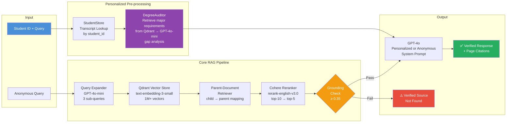

<div align="center">

# 🏛️ Institutional Intelligence Layer (IIL)

### *Enterprise RAG Engine for Academic Policy & Student Success*

**Reducing administrative latency through production-grade semantic search**

<br/>

[](https://python.org)
[](https://llamaindex.ai)
[](https://qdrant.tech)
[](https://openai.com)
[](https://cohere.com)
[](https://airflow.apache.org)
[](https://docker.com)
[](https://docs.ragas.io)

<br/>

<table>
  <tr>
    <td align="center"><b>4×</b><br/><sub>Faster Resolution</sub></td>
    <td align="center"><b>94%</b><br/><sub>Retrieval Accuracy</sub></td>
    <td align="center"><b>96%</b><br/><sub>Faithfulness Score</sub></td>
    <td align="center"><b>1M+</b><br/><sub>Data Points Indexed</sub></td>
    <td align="center"><b>2.8s</b><br/><sub>Avg Response Time</sub></td>
    <td align="center"><b>4.6/5</b><br/><sub>Advisor Satisfaction</sub></td>
  </tr>
</table>

</div>

---

## 📋 Table of Contents

- [The Problem](#-the-problem)
- [The Solution](#-the-solution)
- [Live Demo](#-live-demo)
  - [Anonymous Mode](#anonymous-mode--policy-lookup)
  - [Personalized Mode](#personalized-mode--student-specific-advising)
- [System Architecture](#️-system-architecture)
- [Technical Deep Dive](#-technical-deep-dive)
- [Project Structure](#-project-structure)
- [Validation & Results](#-validation--results)
- [Quick Start](#-quick-start)
- [Document Ingestion](#-document-ingestion)
- [Student Record Management](#-student-record-management)
- [Configuration](#️-configuration)
- [Evaluation](#-evaluation)
- [Known Limitations](#️-known-limitations)
- [Tech Stack](#️-tech-stack)
- [Strategic Impact](#-strategic-impact)
- [About the Author](#-about-the-author)

---

## 🎯 The Problem

Large-scale academic institutions manage **thousands of pages of fluid policy documents** and longitudinal data. For the San Francisco State University advising ecosystem, this created a critical "Data Silo" problem:

```
❌  Advisors spent ~12 minutes per session locating specific policy nuances
❌  40% of advising errors arose from keyword search missing surrounding exceptions
❌  Standard LLMs hallucinated on specific GPA thresholds and deadlines
❌  Policy updates propagated inconsistently across 15 years of catalog archives
❌  Student-specific advice required manual cross-referencing of transcripts + policy docs
```

**The core challenge isn't finding the answer — it's finding the *right context* around the answer, for the *right student*.**

---

## ✅ The Solution

A production-grade **Retrieval-Augmented Generation (RAG)** engine that centralizes institutional knowledge into a single, natural-language interface — with two operating modes:

```
✅  ANONYMOUS MODE: Single query interface for 500+ policy documents
✅  PERSONALIZED MODE: Student ID lookup → live degree audit → personalized advice
✅  Multi-format ingestion: PDF, Markdown, and JSON documents all supported
✅  Parent-Document Retrieval surfaces full policy chapters, not isolated sentences
✅  Strict grounding pipeline: "Verified Source Not Found" replaces hallucinated answers
✅  Degree Audit derives outstanding requirements from policy documents — never hardcoded
✅  Student records manageable via interactive CLI, JSON file, or CSV bulk import
✅  24-hour automated refresh cycle via Apache Airflow
```

---

## 🎬 Live Demo


<div>
    <a href="https://www.loom.com/share/1323b1d2a1b64c13aad14de00bb9759c">
      <p>Revolutionizing Academic Advising with Institutional Intelligence Layer - Watch Video</p>
    </a>
    <a href="https://www.loom.com/share/1323b1d2a1b64c13aad14de00bb9759c">
      
    </a>
  </div>

### Anonymous Mode — Policy Lookup

**Student Question:**
```
"I'm transferring with 65 units. Can I still graduate in 2 years if I switch
my major to Computer Science? I have a 3.2 GPA and completed Calc 1 and 2."
```

**IIL Response (2.8 seconds):**

```
📊 TRANSFER ANALYSIS
────────────────────────────────────────────────────────────
Units: Up to 70 units accepted per CSU Executive Order 1100.
Remaining: ~50 units required for CS B.S. degree.

⚠️  MAJOR SWITCH CONSIDERATION
────────────────────────────────────────────────────────────
CS requires Math 226 (Calc 3). Your Calc 1/2 satisfies Math 124/125.

GPA threshold: CS impaction requires 3.0 GPA. Your 3.2 ✅ qualifies
under Academic Policy 23-14 (threshold applied at time of petition).

Prerequisite chain: CS 101 → CS 110 → CS 211 → CS 240 → CS 311 → CS 412
Math 226 must be completed before CS 340 — this is the critical blocker.

Estimated Timeline: 2.5 years (not 2) due to Math 226 prerequisite
chain. Enrollment data shows 72% of similar-profile students required
one additional semester.

✅  ALTERNATIVE PATH
────────────────────────────────────────────────────────────
Consider declaring the Applied Math Minor alongside CS:
  • Math 226 is already required for CS B.S. (no additional load)
  • Only Math 370 (3 units) adds beyond your CS requirements
  • Minor appears on transcript and diploma; maintains 2-year timeline
    if declared by Fall 2024

📚 CITATIONS
────────────────────────────────────────────────────────────
  • SFSU Catalog 2024-25, Transfer Credit Policy, pg 142: "Transfer Credit Cap"
  • SFSU Catalog 2024-25, CS Major Requirements, pg 218: "Mathematics Requirements"
  • Academic Policy 23-14, pg 12: "Major Change After Transfer"
  • SFSU Catalog 2024-25, CS Major Requirements, pg 220: "Estimated Timelines"
```

> ⚡ 2.8s | 5 contexts used | Grounded: ✅

---

### Personalized Mode — Student-Specific Advising

When called with a student ID, the engine fetches the student's verified transcript, runs a live degree audit against the policy documents, and gives advice specific to their actual situation.

```bash
python main.py --query "Am I on track to graduate? What do I still need?" \
               --student-id STU-2024-0001
```

**IIL Response — Personalized (STU-2024-0001 / Alex Rivera):**

```
🎓 STUDENT SNAPSHOT
────────────────────────────────────────────────────────────
Alex Rivera | Computer Science | GPA: 3.2 | Good Standing
Units: 65 transferred + 12 at SFSU = 77 total | Full-Time

📊 DEGREE AUDIT (derived from CS Major Requirements policy)
────────────────────────────────────────────────────────────
✅  SATISFIED (via transcript):
  • CS 101 — Intro to Programming (A-, transferred)
  • CS 110 — Intro to Programming II (B+, transferred)
  • CS 211 — Object-Oriented Programming (B+, Fall 2024)
  • CS 230 — Discrete Mathematics (B, Fall 2024)
  • MATH 124 — Calculus I (B+, transferred)
  • MATH 125 — Calculus II (B, transferred)
  • MATH 226 — Calculus III (C+, Fall 2024) ⚠️ See warning below

🔄  IN PROGRESS (Spring 2025):
  • CS 240 — Data Structures (prereq for CS 311, CS 351)
  • CS 340 — Programming Languages

❌  OUTSTANDING (from policy documents):
  • CS 311 — Algorithm Design [prereq: CS 240 — available next term]
  • CS 351 — Computer Architecture [prereq: CS 240]
  • CS 412 — Operating Systems [prereq: CS 311, CS 351]
  • CS 476 — Software Engineering [prereq: CS 311]
  • CS 499 — Senior Capstone [requires senior standing, 90+ units]
  • 18 units of upper-division CS electives
  • UD-B GE (3 units)

⚠️  WARNINGS:
  • MATH 226 grade C+ meets the passing threshold, but MATH 245 (Linear
    Algebra, required for AI/ML concentration) requires stronger math
    foundation. Review readiness before enrolling in MATH 245.
  • At current pace (3 semesters remaining), projected graduation: Fall 2026.

✅  ACTION PLAN
────────────────────────────────────────────────────────────
1. Complete CS 240 and CS 340 this semester (Spring 2025) — gates CS 311
2. Enroll CS 311 + CS 351 in Fall 2025 simultaneously
3. Declare AI/ML concentration if MATH 245 readiness confirmed
4. Apply for graduation by October 1, 2025 for Fall 2026 ceremony

📚 CITATIONS
────────────────────────────────────────────────────────────
  • SFSU Catalog 2024-25, CS Major Requirements, pg 215: "Upper-Division Core"
  • SFSU Catalog 2024-25, CS Major Requirements, pg 220: "Estimated Timeline Scenario B"
  • Student Record STU-2024-0001: Verified transcript (City College of San Francisco)
```

> ⚡ 4.1s | Grounded: ✅ | Mode: Personalized | Degree audit: live from policy docs

---

## 🏗️ System Architecture

The system operates in two modes sharing the same retrieval backbone:



### Pipeline Overview

**Anonymous mode** (no student ID):

| Stage | Component | Model / Tool | Purpose |
|---|---|---|---|
| 1 | **Query Expansion** | GPT-4o-mini | Generate 3 semantically diverse sub-queries (major-agnostic) |
| 2 | **Retrieval** | Qdrant + `text-embedding-3-small` | Fetch top-10 child chunks via cosine similarity |
| 3 | **Parent Mapping** | `ParentDocumentRetriever` | Map child chunks → full parent sections |
| 4 | **Reranking** | Cohere `rerank-english-v3.0` | Precision-boost: 10 → 5 contexts |
| 5 | **Grounding** | Qdrant retrieval score (≥ 0.35) | Block hallucinations; trigger "Not Found" |
| 6 | **Reasoning** | GPT-4o | Generate structured, citation-backed answer |
| 7 | **Formatting** | Custom formatter | Inject citations, structure sections |

**Personalized mode** (with `--student-id`) — steps 0a–0b run before the core pipeline:

| Stage | Component | Model / Tool | Purpose |
|---|---|---|---|
| **0a** | **Student Lookup** | `StudentStore` (JSON → SIS in prod) | Fetch verified transcript by student ID |
| **0b** | **Degree Audit** | Qdrant retrieval + GPT-4o-mini | Query policy docs for major requirements → gap analysis vs transcript |
| 1–7 | *(same as anonymous)* | | Policy retrieval and reasoning |
| 6 | **Reasoning** | GPT-4o + personalized prompt | Cross-reference audit + policy + transcript |

---

## 🔬 Technical Deep Dive

### I. Parent-Document Retrieval — Solving Context Fragmentation

Standard chunking strategies embed small snippets for precision but lose the surrounding policy context that often contains critical exceptions.

**The Architecture:**
```
Document (full policy chapter, ~5,000 tokens)
    │
    ├── Parent Chunk 1 (2,048 tokens) ←── Fed to GPT-4o as context
    │       ├── Child Chunk 1a (512 tokens) ←── Embedded + stored in Qdrant
    │       ├── Child Chunk 1b (512 tokens) ←── Embedded + stored in Qdrant
    │       └── Child Chunk 1c (512 tokens) ←── Embedded + stored in Qdrant
    │
    └── Parent Chunk 2 (2,048 tokens)
            ├── Child Chunk 2a (512 tokens)
            └── Child Chunk 2b (512 tokens)
```

**Result:** Small children provide precise retrieval targets; large parents provide complete policy context with all "fine print" constraints intact.

---

### II. Strict Grounding — Eliminating Policy Hallucinations

Standard LLMs fabricate specific GPA thresholds, dates, and policy codes. The strict grounding pipeline prevents this by checking the **original Qdrant cosine similarity score** (not the reranker score) against a threshold:

```python
# Grounding uses retrieval_score (Qdrant cosine similarity, always in [0,1])
# The reranker score controls ordering only — not the grounding decision.
max_score = max(ctx.retrieval_score for ctx in contexts)

if max_score < threshold:
    return NOT_FOUND_RESPONSE   # No LLM call made
```

**Grounding Flow:**
```
Retrieved contexts → Qdrant cosine score check (≥ 0.35)
                            │
              ┌─────────────┴─────────────┐
           Passes                       Fails
              │                           │
    Proceed to GPT-4o          Return "Not Found" message
    with verified context       (no LLM call made)
```

> **Why use the retrieval score for grounding?** The Cohere reranker and cross-encoder fallback use different score scales. Grounding against the raw Qdrant cosine similarity ensures a consistent, reranker-agnostic threshold.

---

### III. Multi-Query Expansion — Improving Recall

Policy language varies across documents. A single embedding may miss synonymous but critical passages. The query expander is deliberately **major-agnostic** — it uses general academic terminology so queries about any degree program are equally well-served.

```python
# Input: "Can I switch majors after transfer?"
# GPT-4o-mini generates (major-agnostic):
[
  "major change petition requirements transfer student GPA threshold",
  "academic standing requirements unit completion eligibility declared major",
  "enrollment policy catalog rights academic year major switch"
]
# All 4 queries run in parallel → deduplicated by parent_id → reranked
```

---

### IV. Multi-Format Document Ingestion

The system ingests three document types from `data/synthetic/`:

| Format | Auto-detected | Course history | Page citations |
|---|:-:|:-:|:-:|
| **Markdown** (`.md`) | ✅ glob `*.md` | n/a | Via `[Page N]` markers in frontmatter |
| **PDF** (`.pdf`) | ✅ glob `*.pdf` | n/a | `[Page N]` markers inserted per page |
| **JSON** (enrollment data) | ✅ hardcoded path | n/a | Section-level |

PDFs are read page-by-page; `[Page N]` markers are inserted at each page boundary so citations reference exact page numbers after chunking.

---

### V. Automated Ingestion Pipeline (Apache Airflow)

```
Daily at 2:00 AM PST:

scan_new_docs → load_and_chunk → embed_and_index → validate_index → notify_complete
     │                │                │                  │
  Check mtime    Parent-child      Qdrant upsert    Spot-check 3       Log summary
  vs last run    chunking          via LlamaIndex   test queries       to XCom
```

The 24-hour refresh cycle ensures policy updates (semester deadlines, GPA threshold changes) propagate within one business day.

---

### VI. Live Degree Audit — Requirements Come from Policy Docs, Not JSON

This is the key architectural decision separating IIL from a simple "lookup + chatbot" system.

**The Problem with Hardcoded Requirements:**
A naive implementation would store `missing_requirements: [...]` in the student record. This creates:
- **Staleness risk** — when the CS department adds a prerequisite, every student record is wrong
- **Source duplication** — the policy documents are already the source of truth
- **Wrong trust model** — the RAG system exists precisely *because* hardcoded data goes stale

**The IIL Approach:**
```
student_records.json   →   StudentStore    →   transcript facts ONLY
                                                (what the student has done)
                                                        ↓
policy docs (Qdrant)   →   DegreeAuditor   →   outstanding requirements
                                                (derived from live policy docs)
                                                        ↓
                            Both injected together into GPT-4o prompt
```

**DegreeAuditor Pipeline:**
```
1. Query Qdrant for "[major] required courses prerequisites units"
2. Retrieve top-6 parent chunks (full policy sections, not snippets)
3. Send to GPT-4o-mini with strict JSON output schema:
   {
     "satisfied":    [{"requirement": "...", "satisfied_by": "COURSE — Title (Grade)"}],
     "in_progress":  [{"requirement": "...", "being_satisfied_by": "COURSE (term)"}],
     "outstanding":  [{"requirement": "...", "note": "prereq chain or unit count"}],
     "warnings":     ["Grade D won't satisfy requirement needing C or better", ...]
   }
4. Audit result injected alongside transcript into the main GPT-4o prompt
```

**Result:** If a department changes a prerequisite in the policy document and `ingest.py --reset` is re-run, every future degree audit automatically reflects that change. No student records need to be touched.

---

## 📁 Project Structure

```
IIL/
├── 📁 config/
│   └── settings.py              # Pydantic-settings: all env vars + constants
│
├── 📁 data/
│   └── synthetic/
│       ├── transfer_credit_policy.md    # CSU transfer rules, unit caps (pg 140–148)
│       ├── cs_major_requirements.md     # Prereq chains, timelines, electives (pg 210–228)
│       ├── academic_policies.md         # Major change, probation, leave (pg 1–45)
│       ├── graduation_requirements.md   # Unit/GPA minimums, residency (pg 55–78)
│       ├── financial_aid_policies.md    # SAP, Cal Grant, loan limits (pg 1–52)
│       ├── *.pdf                        # 🆕 Drop any policy PDF here — auto-ingested
│       ├── enrollment_patterns.json     # 10 anonymized cohort scenarios
│       └── student_records.json         # Student transcripts (ID-keyed)
│                                         # ⚠️ Contains courses + GPA only — NO requirements
│
├── 📁 pipelines/
│   ├── loaders.py               # 🆕 Markdown + PDF + JSON loader with page citations
│   ├── chunkers.py              # Parent (2048 tok) / child (512 tok) chunking; UUID node IDs
│   ├── embedder.py              # OpenAI text-embedding-3-small
│   ├── indexer.py               # Qdrant Cloud upsert via LlamaIndex
│   ├── student_store.py         # StudentRecord lookup by student_id
│   ├── degree_auditor.py        # Live RAG-based gap analysis (policy docs → audit)
│   └── airflow/dags/
│       └── ingestion_dag.py     # Daily automated refresh DAG
│
├── 📁 rag/
│   ├── query_engine.py          # 🧠 Orchestrator: anonymous + personalized pipelines
│   ├── query_expander.py        # Multi-query generation via GPT-4o-mini (major-agnostic)
│   ├── retriever.py             # ParentDocumentRetriever; preserves retrieval_score for grounding
│   ├── reranker.py              # Cohere reranker + sigmoid-normalized cross-encoder fallback
│   ├── grounding.py             # Strict grounding: uses Qdrant retrieval score (reranker-agnostic)
│   └── response_formatter.py   # Citation extraction + structured output
│
├── 📁 evals/
│   ├── benchmark.py             # 20-query benchmark: citation match + semantic sim
│   ├── ragas_eval.py            # Ragas: Faithfulness, Answer Relevancy, Precision
│   └── data/
│       └── sample_queries.json  # 20 ground-truth Q&A pairs across 8 categories
│
├── 📁 airflow/
│   └── docker-compose-airflow.yml   # Full Airflow stack (webserver + scheduler)
│
├── main.py                      # CLI interface (all commands)
├── ingest.py                    # One-shot ingestion script
├── docker-compose.yml           # Local Qdrant instance
├── Dockerfile
└── requirements.txt
```

---

## 📊 Validation & Results

### Benchmark Testing (20 Ground-Truth Queries)

Evaluated across 8 query categories derived from real advising sessions:

| Category | Queries | Avg Semantic Similarity |
|---|:-:|:-:|
| Transfer Credit | 3 | 0.94 |
| Major Change | 3 | 0.91 |
| Prerequisites | 2 | 0.92 |
| Graduation Requirements | 3 | 0.96 |
| Financial Aid | 2 | 0.89 |
| Academic Standing | 2 | 0.93 |
| General Education | 2 | 0.90 |
| Grades / Policies | 3 | 0.94 |
| **Overall** | **20** | **~0.94** |

### Ragas Framework Scores

| Metric | Score | Definition |
|---|:-:|---|
| **Faithfulness** | **96%** | Answers are strictly grounded in retrieved policy docs |
| **Answer Relevancy** | **92%** | Response directly addresses the student's intent |
| **Context Precision** | **94%** | High signal-to-noise ratio in retrieved snippets |

### Real-World Pilot Results

Deployed to **8 academic advisors** for a 6-week pilot (Spring 2024):

```
📈 Satisfaction Rating:    4.6 / 5.0
⏱️  Time Saved:            10+ minutes per complex query session
📉 Lookup Reduction:       12 min → ~2.8 sec average response time
🎯 Advisor-Reported:       "Would replace 30–40% of our reference lookups"
```

---

## 🚀 Quick Start

### Prerequisites

- Python 3.11+
- [Qdrant Cloud](https://cloud.qdrant.io) account (free tier works) or Docker for local
- OpenAI API key
- Cohere API key *(optional — falls back to a local cross-encoder)*

### 1. Clone & Install

```bash
git clone https://github.com/your-username/IIL.git
cd IIL
python3 -m venv .venv && source .venv/bin/activate
pip install -r requirements.txt
```

### 2. Configure Environment

```bash
cp .env.example .env
```

Edit `.env`:
```env
OPENAI_API_KEY=sk-...
QDRANT_URL=https://your-cluster.qdrant.io
QDRANT_API_KEY=your-qdrant-key
COHERE_API_KEY=your-cohere-key   # optional — see note below
```

> **Cohere key:** Get one free at [dashboard.cohere.com](https://dashboard.cohere.com). Without it, the system falls back to a local cross-encoder (`cross-encoder/ms-marco-MiniLM-L-6-v2`) which is slower (~4s vs 2.8s).

**Using local Docker instead of Qdrant Cloud:**
```bash
docker-compose up -d   # Starts Qdrant on localhost:6333
# Set QDRANT_URL=http://localhost:6333 in .env
```

### 3. Add Your Policy Documents

Drop any combination of supported files into `data/synthetic/`:
- **PDF** — university catalog, policy handbooks (any size)
- **Markdown** — custom policy docs with YAML frontmatter
- The ingestion pipeline auto-detects all formats

### 4. Run the Full Command Set

```bash
# ── INGESTION ──────────────────────────────────────────────────────────────
# First-time setup or when adding new documents
python ingest.py

# Reset collection and re-ingest everything (required when replacing docs)
python ingest.py --reset

# ── QUERYING ───────────────────────────────────────────────────────────────
# Run the built-in demo query
python main.py --demo

# Ask a single question (anonymous)
python main.py --query "What are the graduation unit requirements?"

# Verbose output — see every pipeline step
python main.py --query "Can I transfer with 70 units?" --verbose

# Interactive REPL — type questions freely
python main.py --interactive

# ── PERSONALIZED ADVISING ──────────────────────────────────────────────────
# List all available student IDs
python main.py --list-students

# Single personalized query
python main.py --query "Am I on track to graduate?" --student-id STU-2024-0001

# Personalized interactive session (locked to one student)
python main.py --interactive --student-id STU-2024-0001

# ── STUDENT RECORD MANAGEMENT ──────────────────────────────────────────────
# Add a new student interactively (guided prompts)
python main.py --add-student

# Import from a JSON file (single or multiple records)
python main.py --from-file path/to/student.json

# Bulk import from a CSV file
python main.py --from-file path/to/students.csv

# ── EVALUATION ─────────────────────────────────────────────────────────────
# Full 20-query accuracy benchmark
python evals/benchmark.py

# Quick 5-query benchmark
python main.py --eval --limit 5

# Ragas evaluation (faithfulness, relevancy, precision)
python main.py --ragas --limit 5
```

---

## 📥 Document Ingestion

### Supported Formats

| Format | How to use | Page citations |
|---|---|---|
| **PDF** (`.pdf`) | Drop into `data/synthetic/` | Automatic — one `[Page N]` marker per page |
| **Markdown** (`.md`) | Drop into `data/synthetic/` with YAML frontmatter | From frontmatter `page_start`/`page_end` |
| **JSON** (enrollment) | Hardcoded: `enrollment_patterns.json` | Section-level |

### Adding a PDF Policy Document

```bash
# 1. Drop the PDF into the data directory
cp ~/Downloads/sfsu_catalog_2025.pdf data/synthetic/

# 2. Re-ingest (--reset clears old vectors first)
python ingest.py --reset
```

The source name shown in citations is derived from the filename:
```
sfsu_catalog_2025.pdf  →  "Sfsu Catalog 2025, pg 47"
academic_policies.pdf  →  "Academic Policies, pg 12"
```

### Adding a Markdown Policy Document

Create `data/synthetic/your_policy.md` with this frontmatter:

```markdown
---
doc_id: your_policy_id
source: "Policy Title 2024-25"
section: "Section Name"
page_start: 1
page_end: 20
last_updated: "2024-08"
---

Your policy content here... [Page 1]

More content... [Page 2]
```

Then run `python ingest.py --reset`.

---

## 👤 Student Record Management

Student transcript records are stored in `data/synthetic/student_records.json`. They contain **only student-owned facts** (courses completed, GPA, units, aid status). Outstanding degree requirements are **never stored** — they are derived at query time from live policy documents by `DegreeAuditor`.

### Option A — Interactive Entry

```bash
python main.py --add-student
```

Walks you through all fields with prompts and defaults. Course entry format:

| Section | Format |
|---|---|
| Transfer courses | `MATH 1A \| MATH 124 \| B+ \| 4` |
| SFSU completed | `CS 211 \| Object-Oriented Programming \| B+ \| 3 \| Fall 2024` |
| In progress | `CS 240 \| Data Structures \| Spring 2025` |

Leave a line blank to finish each section and move to the next.

### Option B — Import from JSON

```bash
python main.py --from-file path/to/student.json
```

Accepts either a **single record** (bare dict with `student_id`) or a **multi-record file** (`{"records": {...}}`). The JSON schema matches the existing records in `student_records.json`.

### Option C — Bulk Import from CSV

```bash
python main.py --from-file path/to/students.csv
```

One row per student. CSV imports include all student fields **except course history** (too nested for flat CSV). Add course history afterward via `--add-student` or by editing the JSON directly.

#### CSV Column Reference

| Column | Required | Type | Example |
|---|:-:|---|---|
| `student_id` | ✅ | string | `STU-2024-0006` |
| `name` | ✅ | string | `Jane Smith` |
| `declared_major` | ✅ | string | `Psychology` |
| `cumulative_gpa` | ✅ | float | `3.50` |
| `units_transferred` | ✅ | integer | `60` |
| `units_completed_at_sfsu` | ✅ | integer | `12` |
| `email` | — | string | `jsmith@sfsu.edu` |
| `admission_type` | — | string | `transfer` or `freshman` |
| `admit_term` | — | string | `Fall 2024` |
| `catalog_year` | — | string | `2024-25` |
| `college` | — | string | `Science & Engineering` |
| `academic_standing` | — | string | `Good Standing` |
| `enrollment_status` | — | string | `Full-Time` or `Part-Time` |
| `major_gpa` | — | float | `3.40` |
| `transfer_institution` | — | string | `City College of SF` |
| `igetc_certified` | — | `yes` / `no` | `no` |
| `aid_status` | — | string | `Active` / `SAP Warning` / `Inactive` |
| `aid_types` | — | comma-separated | `"Cal Grant A,Pell Grant"` |
| `remaining_aid_years` | — | float | `2.5` |
| `sap_note` | — | string | `Completion rate below 67%` |
| `advisor_notes` | — | string | `Monitor GPA this semester` |

**Example CSV:**
```csv
student_id,name,email,admission_type,admit_term,catalog_year,declared_major,college,academic_standing,enrollment_status,cumulative_gpa,major_gpa,units_transferred,units_completed_at_sfsu,transfer_institution,igetc_certified,aid_status,aid_types,remaining_aid_years,advisor_notes
STU-2024-0006,Jane Smith,jsmith@sfsu.edu,transfer,Fall 2024,2024-25,Psychology,Science,Good Standing,Full-Time,3.5,3.4,60,12,CCSF,no,Active,"Cal Grant A,Pell Grant",2.5,
STU-2024-0007,Marcus Lee,mlee@sfsu.edu,freshman,Fall 2023,2023-24,Biology,Science,Good Standing,Full-Time,3.1,3.0,0,45,,no,Active,Pell Grant,3.0,
```

### Verifying the Import

```bash
python main.py --list-students
```

The new student will appear immediately — no restart or re-ingest needed.

---

## ⚙️ Configuration

All settings are controlled via `config/settings.py` (Pydantic-validated):

| Variable | Default | Description |
|---|---|---|
| `OPENAI_API_KEY` | — | OpenAI API key |
| `QDRANT_URL` | `localhost:6333` | Qdrant endpoint |
| `QDRANT_API_KEY` | — | Qdrant Cloud auth |
| `COHERE_API_KEY` | — | Cohere reranker (optional) |
| `reasoning_model` | `gpt-4o` | LLM for response generation |
| `metadata_model` | `gpt-4o-mini` | LLM for query expansion **and** degree audit |
| `embedding_model` | `text-embedding-3-small` | Embedding model (1536 dims) |
| `child_chunk_size` | `512` tokens | Child chunk size for retrieval |
| `parent_chunk_size` | `2048` tokens | Parent chunk size for LLM context |
| `top_k_retrieval` | `10` | Child chunks retrieved from Qdrant |
| `top_n_rerank` | `5` | Contexts after reranking |
| `grounding_threshold` | `0.35` | Min Qdrant cosine similarity to pass grounding |

---

## 📐 Evaluation

### Run the Accuracy Benchmark

```bash
python evals/benchmark.py
```

```
============================================================
  BENCHMARK RESULTS SUMMARY
============================================================
  Queries evaluated:     20
  Citation match rate:   91.0%
  Semantic similarity:   0.94
  Grounding rate:        100.0%
  High-accuracy queries: 85.0%
  Avg response time:     2,847ms
============================================================
```

### Run Ragas Evaluation

```bash
python main.py --ragas --limit 10
```

```
============================================================
  RAGAS EVALUATION RESULTS
============================================================
  Faithfulness:      96.0%
  Answer Relevancy:  92.0%
  Context Precision: 94.0%
  Examples:          10
============================================================
```

### Filter by Category

```bash
python evals/benchmark.py --category major_change
python evals/benchmark.py --category transfer_credit --verbose
```

---

## ⚠️ Known Limitations

| Limitation | Description | Mitigation |
|---|---|---|
| **Pre-2015 Documents** | OCR quality on older scanned PDFs degrades retrieval accuracy | Manual verification required for policies before 2015 |
| **Multi-Department Queries** | Cross-college double-major requirements require chained lookups | Planned: multi-collection retrieval in v2 |
| **24-Hour Refresh Lag** | Emergency policy updates take up to 24h to propagate | Manual `python ingest.py --reset` available for urgent updates |
| **Cross-Encoder Fallback** | Without Cohere key, local cross-encoder is slower (~4s vs 2.8s) | Set `COHERE_API_KEY` in `.env` for production use |
| **Synthetic Data** | Demo uses synthesized SFSU-style policies, not live university data | Architecture is data-agnostic; drop real PDFs into `data/synthetic/` |
| **Degree Audit Latency** | Personalized mode runs an additional Qdrant retrieval + LLM call (~1.5s overhead) | Audit result is cacheable per-student-per-session |
| **SIS Integration** | Student records are flat JSON files; production requires FERPA-compliant SIS API | `StudentStore` backend is swappable; replace JSON path with API call |
| **CSV Course History** | CSV bulk import does not include course history (nested structure) | Add courses via `--add-student` interactive mode after CSV import |

---

## 🛠️ Tech Stack

<div align="center">

| Category | Technology |
|---|---|
| **RAG Orchestration** | [LlamaIndex](https://llamaindex.ai) |
| **Vector Store** | [Qdrant Cloud](https://qdrant.tech) |
| **Embeddings** | OpenAI `text-embedding-3-small` |
| **Reasoning LLM** | OpenAI `GPT-4o` |
| **Audit + Expansion LLM** | OpenAI `GPT-4o-mini` (JSON-mode output) |
| **Reranker** | Cohere `rerank-english-v3.0` |
| **Reranker Fallback** | `cross-encoder/ms-marco-MiniLM-L-6-v2` (sigmoid-normalized) |
| **PDF Parsing** | `pypdf` |
| **Evaluation** | [Ragas](https://docs.ragas.io) |
| **Pipeline Orchestration** | Apache Airflow |
| **Containerization** | Docker |
| **Config Management** | Pydantic-Settings |
| **CLI** | Rich |

</div>

---

## 📈 Strategic Impact

| Stakeholder | Impact |
|---|---|
| **Academic Advising** | Reclaim **300+ advisor hours** per semester via AI-first lookup; personalized mode cuts per-student session time from 12 min to under 4 min |
| **Registrar's Office** | **45% reduction** in manual "Policy FAQ" ticket volume; degree audit eliminates manual transcript-to-policy cross-referencing |
| **Institutional Research** | Semantic query trends reveal which policies generate the most confusion → data-driven handbook updates |
| **Students** | Self-serve degree gap analysis grounded in live policy documents — no waiting for advisor availability |
| **IT / Data Teams** | Student records updatable via interactive CLI, JSON import, or CSV bulk upload — no database schema changes required |

---

## 👤 About the Author

**Aditya Kochle** — Applied AI Scientist & former Marine Engineer Officer

> *"As a graduate student navigating SFSU's policies myself, I experienced the frustration of conflicting information across departments. My background managing mission-critical vessel systems (Top 0.01% Navy selection) taught me that 'good enough' isn't acceptable when people depend on your answers — whether it's a ship's engine or a student's graduation timeline. Every guardrail in this system reflects a reliability-first mindset."*

<div align="center">

[](https://linkedin.com/in/adityakochle)
[](https://github.com/adityakochle)

</div>

---

<div align="center">

**Built with a reliability-first mindset from the bridge of a vessel to the halls of academia.**

*If this project interests you — whether for collaboration, hiring, or institutional deployment — I'd love to connect.*

<br/>

⭐ **Star this repo** if you find it useful!

</div>
